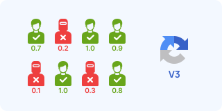
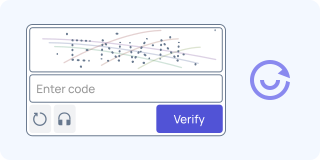
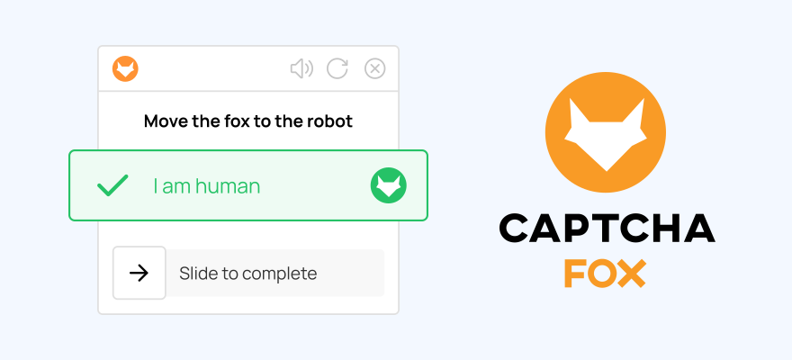

# FuckCaptcha 

**FuckCaptcha** is an open database dedicated to identification methods and bypass techniques for various types of CAPTCHA.

## Contents

- [Project Goal](#project-goal)
- [CAPTCHA Identification](#captcha-identification)
- [Useful Links](#useful-links)

---
## Project Goal
We aim to gather all existing ways to bypass captchas in one place.  Our mission:
- 🆓 **Free Methods**: Collect and maintain an up-to-date list of open-source tools and libraries.
- 💰 **Paid Alternatives**: Provide information about effective paid services for solving complex tasks.
- 🧠 **Knowledge Base**:  Describe the complexity of each captcha and provide step-by-step instructions for bypassing it.

## CAPTCHA Identification

Click on any CAPTCHA below to see detailed information, complexity levels, and both free and paid bypass methods.

|                                                                                    |                                                                                    |                                                                                            |                                                                                                |                                                                                    |
| ---------------------------------------------------------------------------------- | ---------------------------------------------------------------------------------- | ------------------------------------------------------------------------------------------ | ---------------------------------------------------------------------------------------------- | ---------------------------------------------------------------------------------- |
|  |  |          |        |            |
| [**Text-based**](docs/captchas/normal.md)                                          | [**reCAPTCHA v2**](docs/captchas/recaptcha.md#1-recaptcha-v2)                      | [**reCAPTCHA Enterprise**](docs/captchas/recaptcha.md#3-recaptcha-enterprise)              | [**Cloudflare**](docs/captchas/cloudflare.md)                                                  | [**GeeTest**](docs/captchas/geetest.md)                                            |
|         |             |          |                    |    |
| [**Arkose Labs**](docs/captchas/arkose.md)                                         | [**Amazon WAF**](docs/captchas/aws.md)                                             | [**DataDome**](docs/captchas/datadome.md)                                                  | [**MTCaptcha**](docs/captchas/mtcaptcha.md)                                                    | [**Tencent**](docs/captchas/tencent.md)                                            |
|        |      |  |                 |      |
| [**Audio**](docs/captchas/audio.md)                                                | [**Altcha**](docs/captchas/altcha.md)                                              | [**Friendly**](docs/captchas/friendly.md)                                                  | [**ATB**](docs/captchas/atbcaptcha.md)                                                         | [**CaptchaFox**](docs/captchas/captchafox.md)                                      |
|           |      |                        |  |  |
| [**Capy Puzzle**](docs/captchas/capy.md)                                           | [**CutCaptcha**](docs/captchas/cutcaptcha.md)                                      | [**Lemin**](docs/captchas/lemin.md)                                                        | [**Prosopo**](docs/captchas/prosopo.md)                                                        | [**Temu**](docs/captchas/temu.md)                                                  |

## Useful Links
- [Bypass Tools](https://github.com/vsmutok/FuckCaptcha/blob/main/docs/solvers.md) - List of tools and services to bypass CAPTCHAs.
- [Useful Resources](https://github.com/vsmutok/FuckCaptcha/blob/main/docs/resources.md) - Additional resources and articles.

### Contributing

Contributions are welcome! Please see [CONTRIBUTING.md](CONTRIBUTING.md) for details.

---
  
### ⚠️ Disclaimer
  
This repository is created solely for **educational and research purposes**. Use the knowledge acquired responsibly and respect the terms of use of websites. The authors are not responsible for any misuse of the materials.

---

### ⭐ Star History
  
If this project was useful to you, give it a star! ⭐

---
