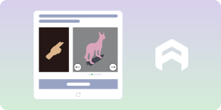

# Arkose Labs / FunCaptcha

**Complexity: ⭐⭐⭐⭐ (High)**

#### How it looks:

#### How to identify:
- **Rotating/matching game challenges**
- Arrow buttons to rotate objects
- **Arkose Labs** or **FunCaptcha** branding
- Used by: Roblox, EA, GitHub, Microsoft

#### Free bypass methods:
- **Custom CNN models** for rotation prediction
- **Stealth automation** with human-like delays
---

#### 💰 Paid alternatives:
If free methods don't work, use API services: **2Captcha**, **Anti-Captcha**, or **CapSolver**. More details in the [Paid services](../solvers.md#paid-services-api) section.
